

  <a href="https://wordpress.org/plugins/shrikant-social-post-builder/">
    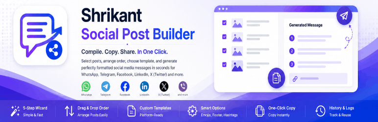
  </a>

  

<h1 align="center">Shrikant Social Post Builder</h1>

  <strong>Compile and format multiple WordPress posts into ready-to-share social media messages in one click.</strong>

  <b>Stable Version:</b> <code>1.0.0</code>

  
  
  

---

## 📖 Overview

**Shrikant Social Post Builder** is a productivity-first WordPress plugin designed for publishers, bloggers, news websites, and content creators who regularly compile and share post updates to social networks like WhatsApp, Telegram, Facebook, LinkedIn, X (Twitter), Viber, and Signal.

Instead of manually copying titles and links for individual posts, this plugin streamlines your sharing workflow down to a few clicks: select posts, drag-and-drop to reorder, choose a template format, and generate a perfectly formatted compiled message ready to copy!

🔗 **Official WordPress Plugin Page**: [https://wordpress.org/plugins/shrikant-social-post-builder/](https://wordpress.org/plugins/shrikant-social-post-builder/)

---

## ⚡ Key Features

* 🔍 **Smart Post Selection**: Search posts by title, or filter by category, tag, author, and date range.
* ↕️ **Drag-and-Drop Sorting**: Instantly rearrange the sequence of posts before compiling.
* 🎨 **Platform Templates**: Default pre-formatted template structures for WhatsApp, Telegram, Facebook, LinkedIn, and X.
* 📝 **Custom Template Creator**: Build custom layout templates using simple, dynamic placeholders.
* ⚙️ **Layout Preferences**: Toggle list numbers, include emojis, and append custom footers or hashtags.
* 📋 **One-Click Copy**: Copy generated text instantly with a single button click.
* 🗃️ **Trace History Logs**: Logs all compiled messages in a local database with duplicate detection.
* 🧹 **Auto-Retention Engine**: Automatically delete old history logs based on days or total records limit to save database space.

---

## 🧩 Supported Template Placeholders

When designing custom templates, you can use the following dynamic tags to structure your compiled posts:

| Placeholder | Replaced With |
| --- | --- |
| `{{title}}` | The title of the WordPress post |
| `{{url}}` | The permalink URL of the post |
| `{{excerpt}}` | The post excerpt or brief summary |
| `{{date}}` | The publication date of the post |
| `{{author}}` | The display name of the post author |
| `{{website}}` | The custom website URL defined in settings |
| `{{footer}}` | The default footer text defined in settings |
| `{{hashtags}}` | The default group of hashtags defined in settings |

---

## 📸 Screenshots Gallery

### 1. Dashboard Metrics Summary
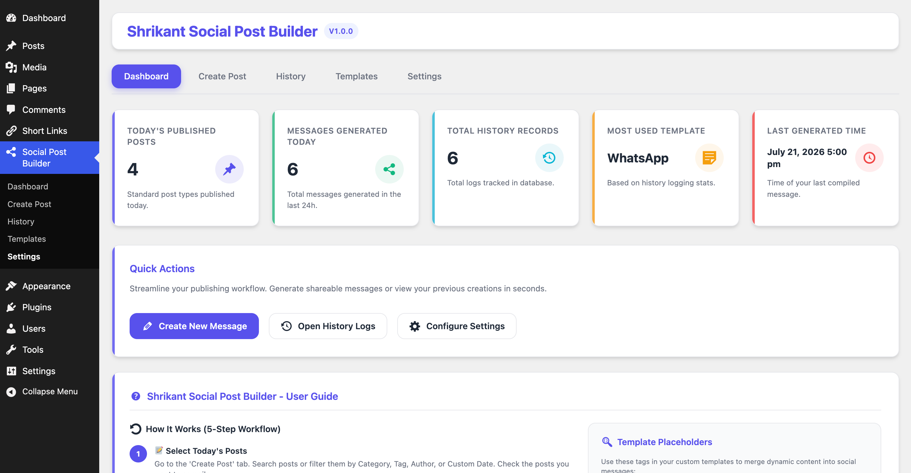

### 2. Multi-Post Filter and Selector (Step 1)
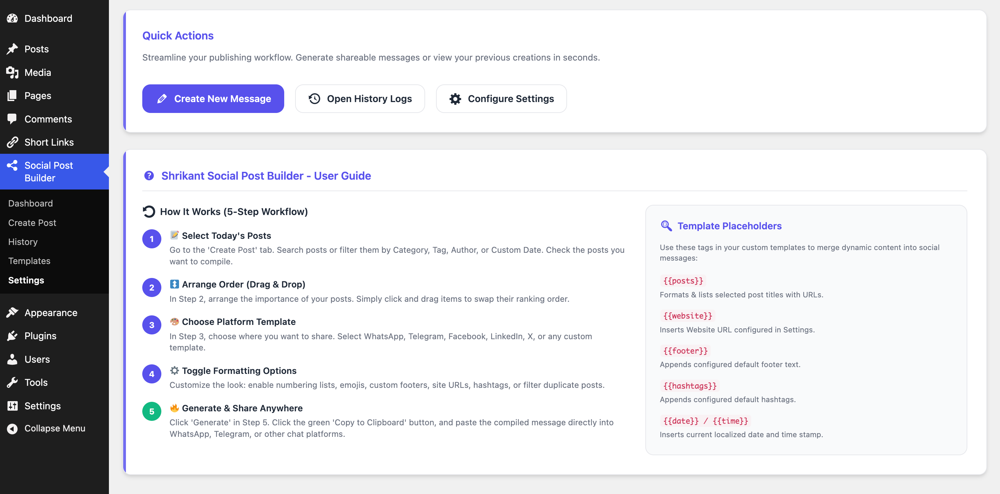

### 3. Drag-and-Drop Post Order sorting (Step 2)
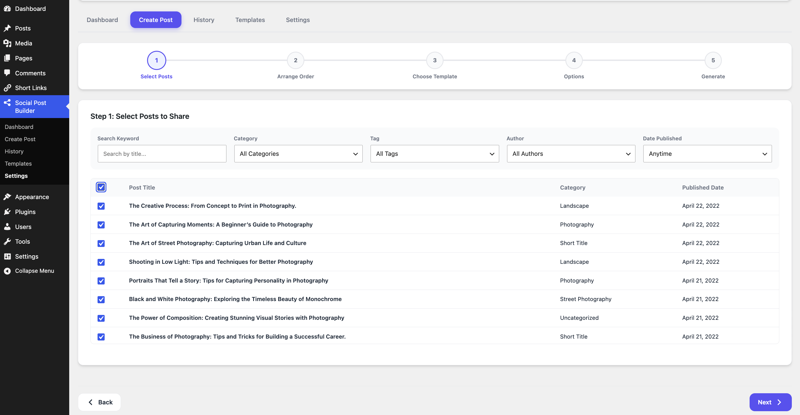

### 4. Template Selection with Brand SVG Icons (Step 3)
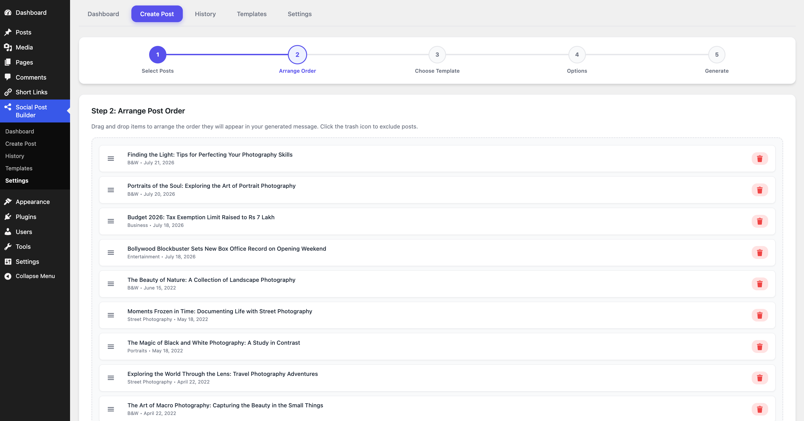

### 5. Formatting Options Customizer (Step 4)
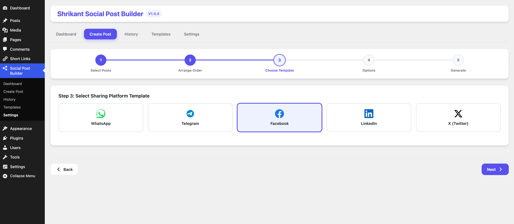

### 6. Instantly Compiled ready-to-share Output (Step 5)
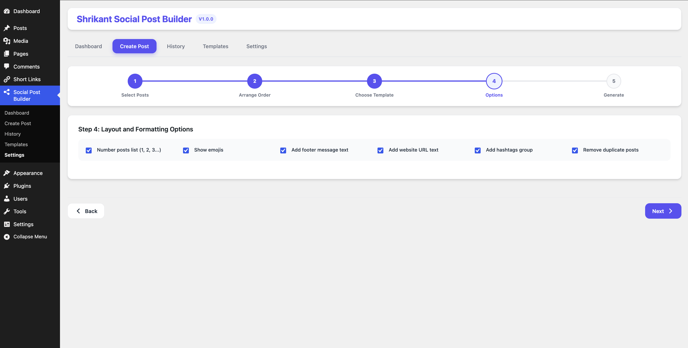

### 7. Custom Social Platform Templates Manager
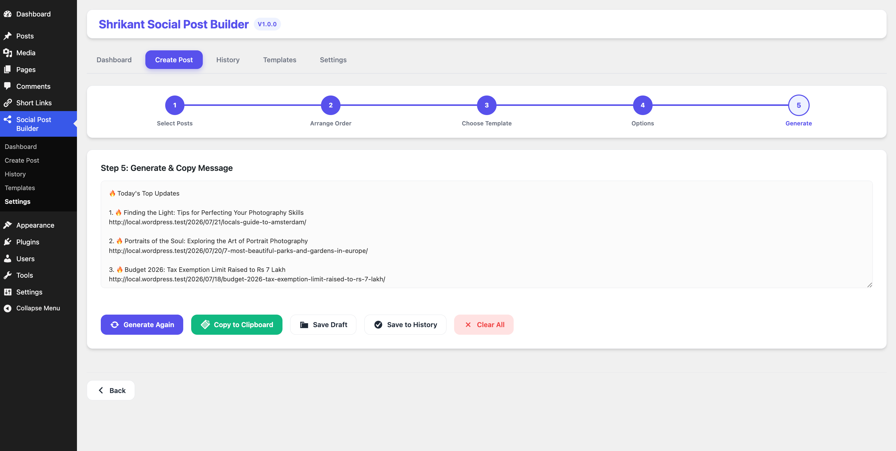

### 8. Custom Template Editor Workspace
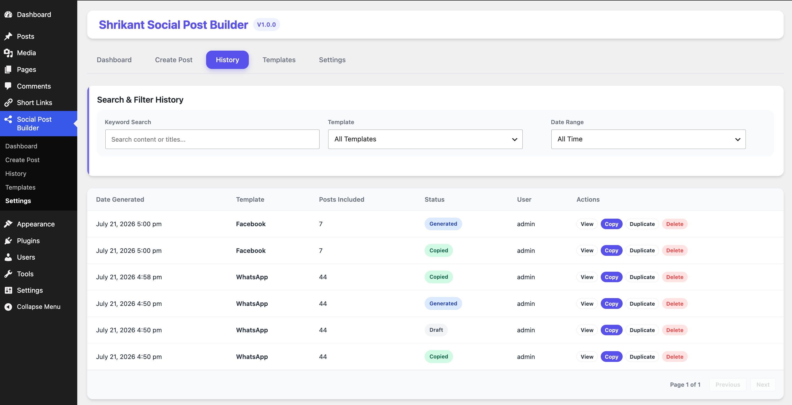

### 9. Generated Compilation History Logs
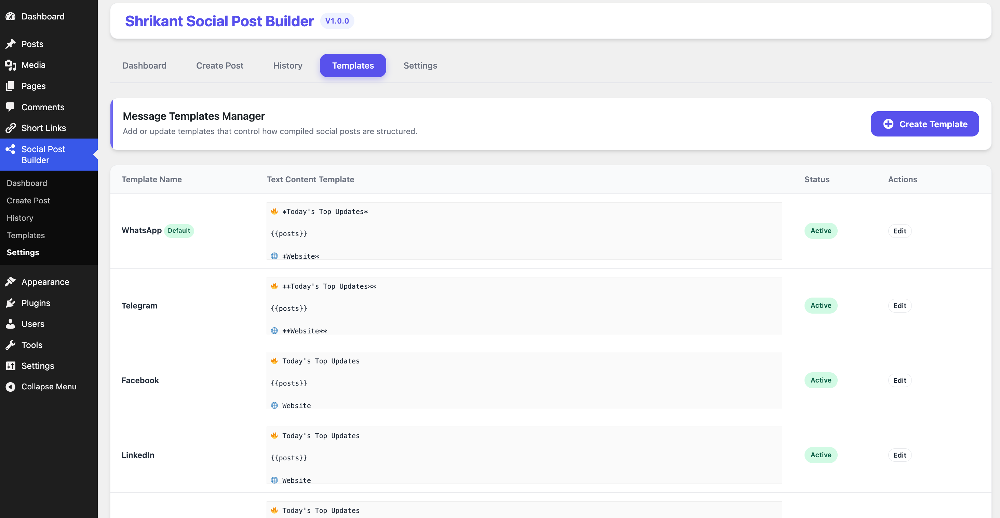

### 10. General and Database Retention Settings
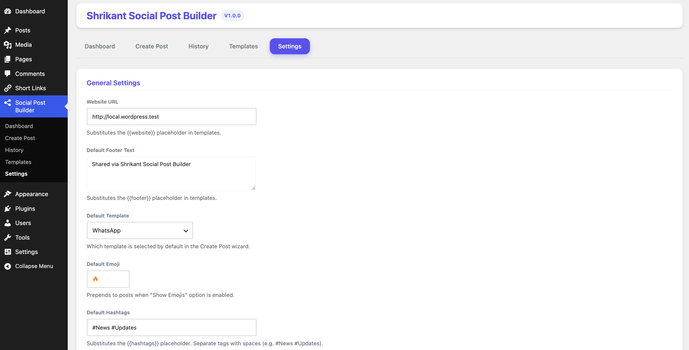

---

## ⚙️ Installation

1. Upload the plugin files to the `/wp-content/plugins/shrikant-social-post-builder` directory, or install the plugin directly through the WordPress admin panel: **Plugins > Add New**.
2. Activate the plugin through the **Plugins** screen in WordPress.
3. Access the **Social Post Builder** dashboard from your admin side menu to start compiling posts.

---

## 📝 License

This project is licensed under the GPLv2 or later License - see the [LICENSE](https://www.gnu.org/licenses/gpl-2.0.html) file for details.

